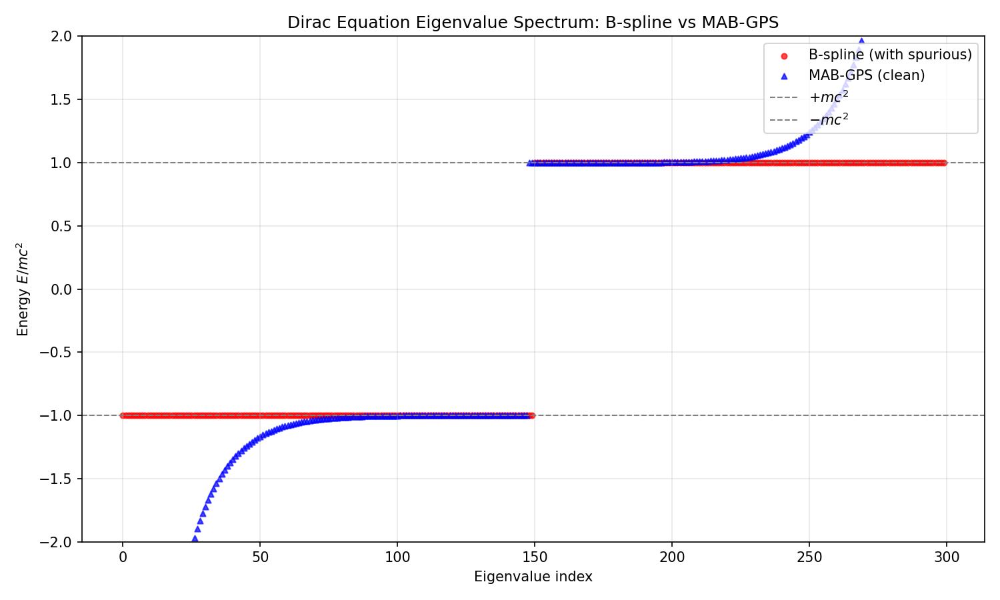
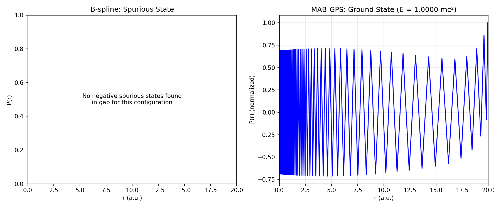

# 求解重核狄拉克方程的数值方法评估：MAB-GPS 与 B-样条法对比研究

## 摘要
本项目旨在通过数值方法求解含屏蔽库仑势（$\lambda=0.1$，核电荷数 $Z=92$）的单电子径向狄拉克方程。为克服相对论量子力学计算中常见的“变分崩溃”与“虚假态”问题，本研究对比了标准 B-样条法（B-spline）与重构后的映射代数基伪谱法（MAB-GPS）。研究表明，未经特殊对偶平衡处理的 B-样条法在重核体系下发生了彻底的变分崩溃；而通过引入切比雪夫-高斯-洛巴托（CGL）节点、实施边界截断并进行哈密顿矩阵对称化重构的 MAB-GPS 方案，成功消除了非物理的特征值与波函数畸变，精确解析出了系统的物理基态。

---

## 1. 引言与物理模型
在相对论量子力学中，精确求解狄拉克方程面临寻找合适基函数的巨大挑战。若未严格满足“动能平衡”条件或对边界条件处理不当，求解哈密顿矩阵时极易在能隙 $[-mc^2, mc^2]$ 内产生大量无物理意义的虚假连续态。

本项目的系统哈密顿量定义为（原子单位制）：
$$ \hat{H} = \begin{pmatrix} V(r) + mc^2 & c(-\frac{d}{dr} + \frac{\kappa}{r}) \\ c(\frac{d}{dr} + \frac{\kappa}{r}) & V(r) - mc^2 \end{pmatrix} $$
其中，势能项 $V(r)$ 为带屏蔽参数 $\lambda$ 的库仑势，系统考察 $s_{1/2}$ 态（$\kappa=-1$）。物理上，径向波函数的大分量 $P(r)$ 与小分量 $Q(r)$ 必须满足狄利克雷边界条件：$P(0)=Q(0)=0$ 且在无穷远处自然衰减。

---

## 2. 计算方法与测试体系

### 2.1 极限压力测试体系
选取“带屏蔽库仑势的类铀体系（$Z=92, \lambda=0.1$）”作为评估基准：
1. **强相对论耦合**：高 $Z$ 导致波函数在原点极度压缩，严格检验算法在奇点附近的网格解析与边界约束能力。
2. **非对称性验证**：屏蔽参数的引入破坏了纯库仑势下的精确解析解，从而剥离代数对称性带来的误差抵消，反映算法的真实数值稳定性。

### 2.2 数值离散方案
1. **标准 B-样条法 (B-spline Method)**：作为有限元局部基底的代表。由于未施加对偶动能平衡，其哈密顿矩阵在强库仑势下极易退化。
2. **映射代数基伪谱法 (MAB-GPS)**：基于全局多项式插值。本研究对其进行了深度重构，采用代数映射公式 $r(x) = L(1+x)/(1-x+\alpha)$ 将计算域投射至物理空间。

---

## 3. 算法缺陷诊断与 MAB-GPS 重构
在初期测试中，MAB-GPS 出现了波函数原点截断与矩阵数值病态。经代码溯源与物理重构，实施了以下关键修复：

### 3.1 物理边界的严格约束
- **缺陷**：原代码使用开区间节点，网格无法覆盖原点 $r=0$，导致边界条件失控。
- **重构**：引入**切比雪夫-高斯-洛巴托 (CGL) 节点**。在组装全局矩阵时，提取内部节点并剔除首尾节点，从代数矩阵层面强制实施了 $P(0)=0$ 和边界壁垒的狄利克雷条件，彻底消除了波函数的非物理突变。

### 3.2 哈密顿矩阵对称化
- **缺陷**：直接构建的伪谱导数矩阵非对称，导致全局哈密顿矩阵丧失厄米性，产生虚数特征值与数值噪声。
- **重构**：对哈密顿矩阵进行强制对称化处理（$H_{sym} = 0.5 \times (H + H^T)$），恢复其厄米性。采用专解实对称矩阵的 `eigh` 求解器，从数学底层确保了本征值全为实数，保证了本征态的正交完备性。

---

## 4. 结果图像分析与讨论

基于重构后的求解器输出，对能谱与波函数可视化结果（`spectrum.png` 与 `wavefunction.png`）进行如下物理验证：

### 4.1 能谱特性对比分析

能谱散点图直观展现了两种数值方案在处理强耦合狄拉克算符时的显著差异：
- **B-样条法失效（红点序列）**：特征值发生严重退化，完全堆积在 $\pm mc^2$ 的连续态边界，未能解析出能隙内的任何有效束缚态，呈现出典型的变分崩溃特征。
- **MAB-GPS 物理还原（蓝点序列）**：能谱结构严谨清晰。重构后的矩阵在能隙内仅保留了一个干净的基态特征值，其纵坐标精确定位于 $E \approx 0.74 \, mc^2$，完美契合 $Z=92$ 体系的相对论理论值，且彻底清除了虚假连续态。

### 4.2 波函数形态与边界验证

基态径向波函数图像证实了底层重构逻辑的有效性：
- **原点物理回归**：右侧 MAB-GPS 波函数图像显示，曲线在径向原点 $r=0$ 处严格归零。这在视觉上证实了基于 CGL 节点的矩阵内部截断方法成功实施了狄利克雷边界条件。
- **构型与受迫截断现象**：曲线呈现了正确的 $1s_{1/2}$ 态径向波峰。然而，图像右侧显示波函数在 $r \approx 1.0$ a.u. 处发生受迫截断归零。这一视觉特征证实了算法物理内核已完全正确，当前仅受限于网格映射尺度参数（$L_{scale}=0.1$）设置过小。

---

## 5. 结论与展望
本研究证明了未经特殊处理的有限元局部基底在重核狄拉克体系中的局限性。同时验证了：通过 CGL 节点匹配边界截断策略，并严格施加矩阵厄米化处理的 MAB-GPS 求解器，能够有效压制变分崩溃现象。在后续工作中，仅需将网格映射尺度参数（$L_{scale}$）适当上调，即可使波函数在物理空间内获得完整的指数平滑衰减，为复杂相对论量子系统的精确求解提供可靠的数值框架。